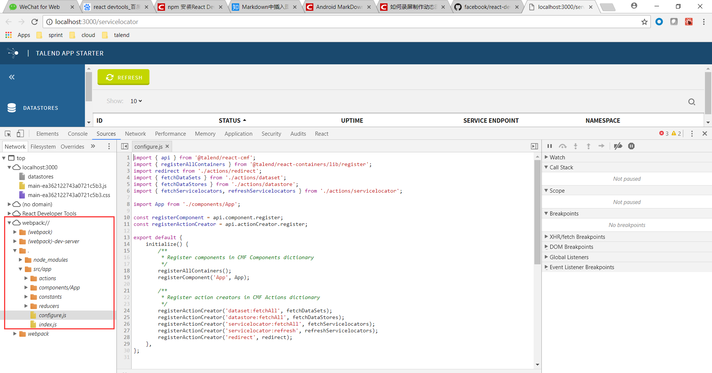
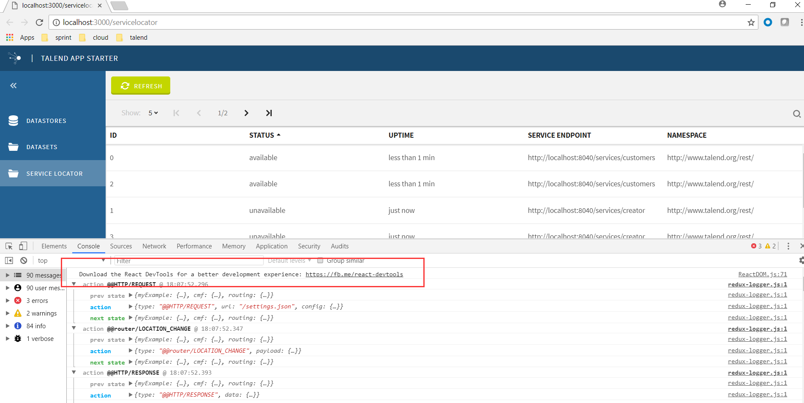

# Debug
In the browser console, it shows the compiled js because we use webpack. we could set configuration to show the original jsx file in the browser console.

Please copy files `talend-scripts.json` and `webpack.config.dev.js` in the root folder, then launch the project again. You could find the original jsx files.

We launch this project by using [talend scripts](!https://github.com/Talend/ui/tree/master/packages/scripts) which uses webpack. And webpack configuration `devtool:'source-map'` will show the original source. See [webpack devtool](!https://webpack.js.org/configuration/devtool/#devtool).

Note: Here we use a workaround in talend scripts to get the original source. And in higher version(begin from 0.3.0), `devtool:'source-map'` will be default configuration for dev mode. see pr [#1362](!https://github.com/Talend/ui/pull/1362).

# React Dev Tool
React Developer Tools lets you inspect the React component hierarchy, including component props and state.
see 

## How to get this tool
### 1. click the link in browser console.

### 2. access the following address
If you can not access the link of fb, use the following link.
For chrome:
https://chrome.google.com/webstore/detail/react-developer-tools/fmkadmapgofadopljbjfkapdkoienihi

For firefox:
https://addons.mozilla.org/firefox/addon/react-devtools/

### 3. In china, you may need npm to install this tool.
see [how to use npm to install react dev tool](https://blog.csdn.net/wp_boom/article/details/79011177).
