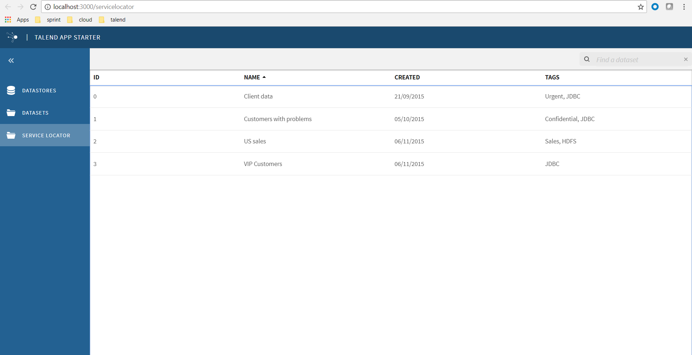

In this step, we would create a simple module named service locator. 

# Add a module

We set its own route, view and action configurations in src/assets/settings.json, also register the action in configure.js.
```
git apply --whitespace=fix 0001-step1-add-a-module.patch
```


## 1. set configurations in src/assets/settings.json.
Add action configuration in src/assets/settings.json.
Action means the user event, like click, drag and so on.

```
"menu:servicelocator": {
    "id": "menu:servicelocator",
    "label": "Service Locator",
    "icon": "talend-folder",
    "payload": {
      "type": "MENU_LINK",
      "cmf": {
        "routerReplace": "/servicelocator"
      }
    }
}
```

Add view configuration in src/assets/settings.json. 
We can define side panel, header bar, action dropdown, list and so on.

```
"servicelocator": {
    "didMountActionCreator": "servicelocator:fetchAll",
    "sidepanel": { "_ref": "SidePanel#default" },
    "list": {
      "collectionId": "datasets",
      "list": {
        "columns": [
          { "key": "id", "label": "ID" },
          { "key": "label", "label": "Name" },
          { "key": "created",  "label": "Created" },
          { "key": "tags", "label": "Tags" }
        ]
      },
      "toolbar": {
        "filter": {
          "placeholder": "Find a dataset"
        },
        "sort": {
          "options": [
            { "id": "label", "name": "Name" },
            { "id": "created", "name": "Created" }
          ]
        }
      },
      "initialState": {
        "sortOn": "label"
      }
    }
}
```	
	
Add route configuration in src/assets/settings.json.
```
{
    "path": "servicelocator",
    "component": "HomeListView",
    "view": "servicelocator"
}
```	
	
Add sidepanel configuration in src/assets/settings.json.
```
	"actionIds": ["menu:datastores", "menu:datasets","menu:servicelocator"]
```	

	
## 2. Register action in src/app/configure.js.
```
	registerActionCreator('servicelocator:fetchAll', fetchDataSets);
```
	
In next step, we will show servicelocator's own data in servicelocator.json.
	
