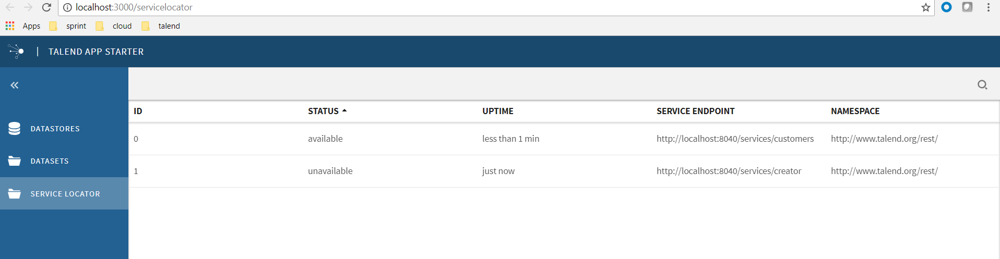

In this steps, we transfer servicelocator data collections and show it in servicelocator module as a list.

# Transfer data to list.

You could use git command by `apply --whitespace=fix 0001-how-to-set-collection-data` to see the result. See step2.png.


I have creatd a assets/servicelocators.json which are fake data.

## 1. set servicelocator list view configuration.
Firstly, we check the servicelocator view configuration in settings.json. It defines list and toolbar view. In the list, there are columns definitions.

modify its columns to be:
```
"columns": [
  { "key": "id", "label": "ID" },
  { "key": "status", "label": "Status" },
  { "key": "uptime", "label":"Uptime"},
  { "key": "endpoint",  "label": "Service Endpoint" },
  { "key": "namespace", "label": "Namespace" }
]
```

modify its toolbar and sort to be:
```
"toolbar": {
  "filter": {
    "placeholder": "Find a servicelocator"
  },
  "sort": {
    "options": [
      { "id": "label", "name": "Name" },
      { "id": "status", "name": "Status" }
    ]
  }
},
```

## 2. add action to fetch the servicelocators.json

```
import {actions} from '@talend/react-cmf';
import {GETTING_SERVICELOCATORS, ERROR_GETTING_SERVICELOCATORS} from '../constants/servicelocators';

export function fetchSevivelocators(){
	return actions.http.get('/servicelocators.json', {
		// action type to dispatch before fetch
		onSend: GETTING_SERVICELOCATORS,
		// action type to dispatch on fetch error
		onError: ERROR_GETTING_SERVICELOCATORS,
		// CMF action config
		// collectionId is the key where the result will be stored in app state
		cmf: {
			collectionId: 'servicelocators',
		},
	});
}
```

This actions is a saga action wrapper, which create onSend, onError action status, and the collection id for cmf collection state.

Then we modify the collection id in servicelocator view configuration in settings.json to match this id.
```
	"collectionId": "servicelocators",
```

## 3. register fetchSevivelocators in cmf actions. See modifications in configure.js.
```
registerActionCreator('servicelocator:fetchAll', fetchSevivelocators);
```

please see original guid in node_modules/@talend/react-cmf/howto/how-to-manage-collections.md
