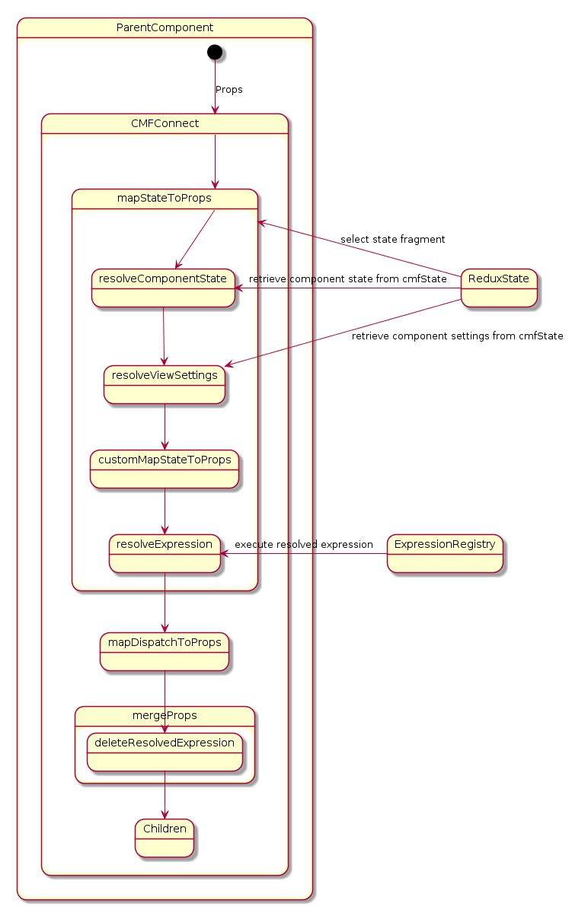

This step we will learn the basically important concept and component in cmf.

Please see [api](api.md), [App](App.md), [cmfConnect](cmfConnect.md), [Dispatcher](Dispatcher.md), [expressioin](expression.md), [onEvent](onEvent.md), [registry](registry.md), [settings](settings.md), [store](store.md).
And for the whole shema, see schema.png.

In next step, we will show the action trace by adding middleware redux-logger.
Please see https://www.npmjs.com/package/redux-logger for the basic introduction.

Please see latest guid by the following links.

[App](https://github.com/Talend/ui/blob/master/packages/cmf/src/App.md)
[Dispatcher](https://github.com/Talend/ui/blob/master/packages/cmf/src/Dispatcher.md)
[actionCreator](https://github.com/Talend/ui/blob/master/packages/cmf/src/actionCreator.md)
[api](https://github.com/Talend/ui/blob/master/packages/cmf/src/api.md)
[cmfConnect](https://github.com/Talend/ui/blob/master/packages/cmf/src/cmfConnect.md)
[expression](https://github.com/Talend/ui/blob/master/packages/cmf/src/expression.md)
[onEvent](https://github.com/Talend/ui/blob/master/packages/cmf/src/onEvent.md)
[registry](https://github.com/Talend/ui/blob/master/packages/cmf/src/registry.md)
[settings](https://github.com/Talend/ui/blob/master/packages/cmf/src/settings.md)
[store](https://github.com/Talend/ui/blob/master/packages/cmf/src/store.md)
