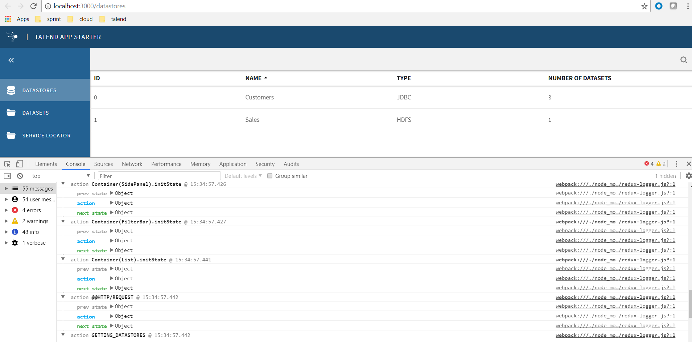

This step we will add redux-logger for action trace. With this middleware, we can get the previous state, current action, next state in web browser condole. It helps a lot.



please see [redux middlewares acknowledge](https://redux.js.org/advanced/middleware) and [basic introduction for redux-logger](https://www.npmjs.com/package/redux-logger).

Redux middlewares will change process from action -> reducer to be action -> middlewares -> reducer.

```
import { createStore, applyMiddleware } from 'redux';
let store = createStore(
  reducers,
  initialState,
  applyMiddleware(A, B, C)
)
```

Then if a action is dispatched, then the trigger process will be A(action) -> B(action) -> C(action) -> store.dispatch(action), but the execute process will be C(action) -> B(action) -> A(action).

In @talend/react-cmf store.js, the api for store initialization is initialize(appReducer, preloadedState, enhancer, middleware). So we apply logger in idex.js.

```
import logger from 'redux-logger';

const store = cmfstore.initialize(appReducer, undefined, undefined, logger);
```
