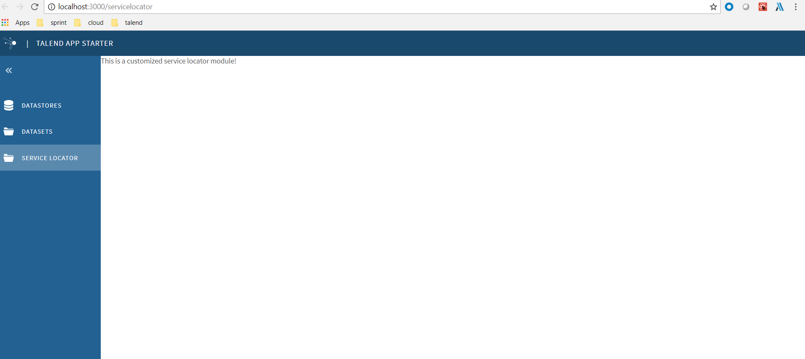

This step we will create a customized service locator module.
See  

The main idea is we replace the default HomeListView by a customized view CHomeListView. In CHomeListView, we could use our own module.
